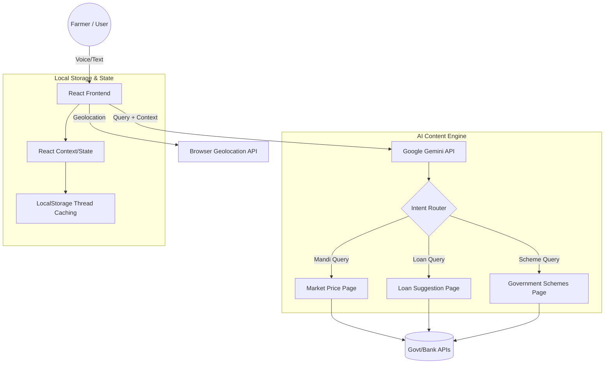

# 🌾 GraamSeva: AI-Powered Rural Empowerment 🇮🇳

> **Bridging the Digital Divide for 700M+ Citizens through Voice and AI.**

GraamSeva is a state-of-the-art AI platform designed specifically for rural Indian farmers. It simplifies and democratizes access to government welfare schemes using advanced **Large Language Models (LLM)**, **Real-time Geolocation**, and **Voice-to-Voice Interaction**.

---

## ✨ Key Features

### 🤖 Intelligent AI Chatbot (Gemini Powered)
The heart of GraamSeva is an **LLM-driven Assistant** that:
- **Understands Context**: "I have 10k for a tractor" → Identifies as a downpayment and suggests loans.
- **Smart Redirection**: Automatically navigates users to Mandis, Loans, or Scheme pages based on intent.
- **Strict Localization**: Responds in the user's preferred language (Hindi, Bhojpuri, Awadhi, Odia, Marathi, Maithili).

### 📍 Location-Aware Intelligence
- **Nearby Discovery**: Integrated with browser Geolocation to suggest the closest Mandis (markets) and Bank branches.
- **Dynamic Data**: Real-time price and distance estimation based on actual user coordinates.

### 🎤 Voice-First Interface
- **Low Literacy Optimized**: No typing required. Users speak in their native tongue.
- **Web Speech API**: Browser-native, high-performance transcription.

### 🌐 Regional Language Support
- **Inclusive Access**: Users can switch the entire interface to their preferred regional language.
- **Full Interface Translation**: Schemes, chatbot responses, and all translatable UI elements adapt automatically.
- **Supported Languages**: Hindi, Bhojpuri, Awadhi, Marathi, Maithili, Odia, and English.

### 📊 Operator Dashboard
- **CSC Management**: Real-time KPI monitoring, language distribution analytics, and application tracking for village operators.

---

## 🏗️ System Architecture



---

## 🛠️ Technology Stack

| Layer | Technology |
| :--- | :--- |
| **Frontend** | React 19, Vite, Tailwind CSS |
| **Backend** | DjangoRest Framework  |
| **AI / LLM** | Google Gemini 2.5 Flash |
| **Styling** | Simple Minimal , Responsive Grid |
| **Icons** | Material Design Icons |

---

## 🚀 Quick Setup

### 1. Prerequisites
- Node.js (v18+)
- npm
- django

### 2. Installation
```bash
# Navigate to the frontend directory
cd GraamSevaFrontend

# Install dependencies
npm install
```
```bash
# Navigate to the backend directory
cd Backend

# start Venv
source venv/bin/activate

cd GraamSeva
python manage.py runserver
```

### 3. Environment Configuration
Create a `.env` file in `GraamSevaFrontend/` and add your Gemini API Key:
```env
VITE_GEMINI_API_KEY="your_google_gemini_api_key"
```

### 4. Run Development Server
```bash
npm run dev
```
Open `http://localhost:5173` to explore.

---

## 📂 Project Structure
```text
GraamSevaFrontend/
├── src/
│   ├── components/       # Reusable UI (AssistantBar, etc.)
│   ├── pages/            # 12+ Feature Pages (Mandi, Loan, Dashboard)
│   ├── services/         # LLM, Voice, and API logic
│   ├── constants/        # App configuration & language maps
│   └── lib/              # i18n and Utility helpers
├── .env                  # API Keys (Git ignored)
└── vite.config.js        # Build configuration
```

---

## 🛡️ Security
- **Untracked Secrets**: `.env` is removed from Git history and excluded via `.gitignore`.
- **API Safety**: LLM responses are parsed strictly to prevent injection.

---

## 🏆 Acknowledgments
Built by **Team Bada Pikachu** (IIT Roorkee) for the **AI Unlocked Hackathon**.

*"Serving the roots of India with the power of the cloud."*
